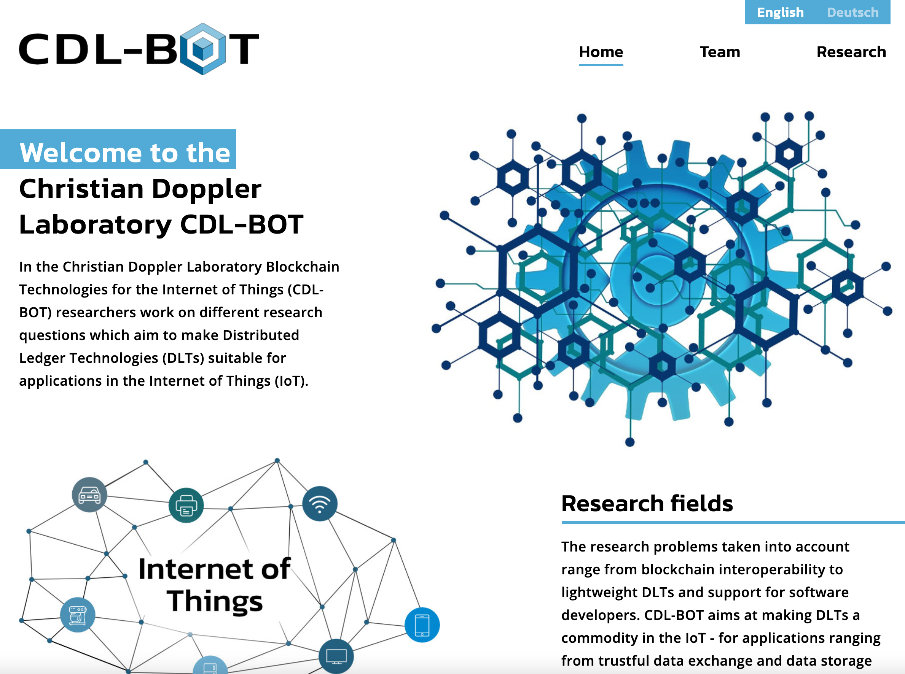

# CDL-BOT Website

This repository contains a nextjs website template for [cdl-bot.at](https://cdl-bot.at).

### Remarks
* The content of the page has been migrated to sanity
* The default domain `cdl-bot.at` redirects to the `www` subdomain with `web/miscellaneous/.htaccess` in an apache environment
* If a second domain is used, a `canonical` tag must be specified to prevent search engines from blocking duplicate content
* Add sameAs-links in the meta-component if social profiles or other web-presences are published
* This project uses nextjs with the next-i18next extension from [here](https://github.com/isaachinman/next-i18next)
* Even there already exists nextjs v10 with i18n support, there is no automatic prefix-redirection so we stick to this solution
* If the redirection from [here](https://github.com/vercel/next.js/discussions/18419) is implemented, we could change to this approach and make use of [this](https://github.com/vinissimus/next-translate) library (this approach brings also performance benefits)
* There is also a discussion going on if static export should be supported with nextjs, maybe implement this if its integrated
* Until now an old solution is beeing used and for merging server-side data fetching and translating, a hacky solution from [here](https://github.com/isaachinman/next-i18next/issues/652#issuecomment-644618517) is used
* Currently, the DNS requests to `http://cdl-bot.at` is resolved to a web space containing the `.htaccess` file from the miscellaneous folder that redirects to the subdomain `http://www.cdl-bot.at`.

